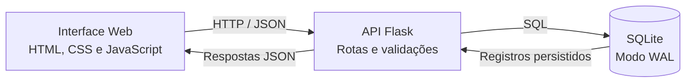
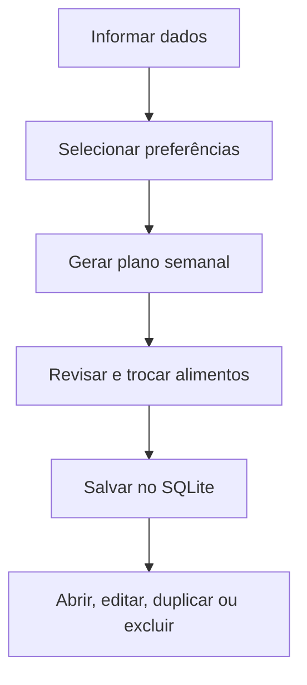
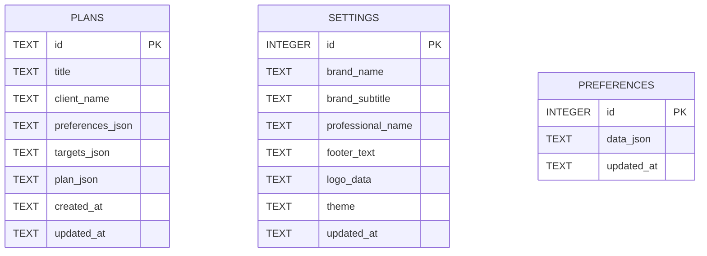

<div align="center">

# 🥗 Planejamento Nutricional

**Sistema web para criar, personalizar, salvar e gerenciar planos alimentares semanais.**

<br>

[](https://www.python.org/)
[](https://flask.palletsprojects.com/)
[](https://www.sqlite.org/)
[](https://developer.mozilla.org/docs/Web/JavaScript)
[](#interface)

<br>

[Visão geral](#-visão-geral) ·
[Funcionalidades](#-funcionalidades) ·
[Instalação](#-instalação) ·
[API](#-api-rest) ·
[Banco de dados](#-banco-de-dados)

</div>

---

## ✨ Visão geral

O **Planejamento Nutricional** é uma aplicação full stack construída com **Flask**, **SQLite** e **JavaScript puro**.

A plataforma gera um cronograma alimentar semanal a partir de dados básicos e preferências selecionadas pelo usuário. Os planos podem ser salvos, abertos novamente, editados, duplicados, pesquisados, impressos e excluídos.

<table>
<tr>
<td width="33%" align="center">
<strong>Planejamento semanal</strong><br>
<sub>Distribuição de refeições durante os sete dias.</sub>
</td>
<td width="33%" align="center">
<strong>Persistência real</strong><br>
<sub>Planos e configurações armazenados em SQLite.</sub>
</td>
<td width="33%" align="center">
<strong>Personalização</strong><br>
<sub>Marca, logotipo, tema e impressão configuráveis.</sub>
</td>
</tr>
</table>

> [!IMPORTANT]
> Os cálculos nutricionais apresentados são estimativas automáticas e não substituem avaliação ou acompanhamento profissional.

---

## 🚀 Funcionalidades

<table>
<tr>
<td width="50%">

### Planejamento

- Cálculo estimado de calorias
- Cálculo estimado de proteínas
- Sugestão de consumo de água
- Configuração de 3 a 6 refeições por dia
- Planejamento para os sete dias da semana
- Rotinas rápidas, convencionais ou variadas

</td>
<td width="50%">

### Alimentos

- Seleção por categorias
- Pesquisa de alimentos
- Filtros rápidos
- Perfil vegetariano
- Troca individual de alimentos
- Troca completa de refeições

</td>
</tr>
<tr>
<td width="50%">

### Gerenciamento

- Cadastro de novos planos
- Edição de planos existentes
- Duplicação de planejamentos
- Exclusão de registros
- Pesquisa por nome
- Exportação de backup em JSON

</td>
<td width="50%">

### Personalização

- Upload de logotipo
- Nome da marca ou profissional
- Tema visual
- Rodapé personalizado
- Impressão em formato A4
- Interface responsiva

</td>
</tr>
</table>

---

## 🧰 Tecnologias

| Área | Tecnologia | Responsabilidade |
|---|---|---|
| Back-end | Python + Flask | Rotas, validações e API |
| Persistência | SQLite | Planos, preferências e configurações |
| Front-end | HTML5 + CSS3 | Estrutura e interface |
| Interatividade | JavaScript | Cálculos, formulários e consumo da API |
| Templates | Jinja2 | Renderização da interface |
| Comunicação | JSON / REST | Integração entre front-end e back-end |

---

## 🏗️ Arquitetura



### Fluxo principal



---

## 📁 Estrutura

```text
planejamento_nutricional_sqlite/
│
├── app.py
├── database.sqlite3
├── requirements.txt
├── INICIAR.bat
├── iniciar.sh
├── README.md
│
└── templates/
    └── index.html
```

<details>
<summary><strong>Detalhes dos arquivos</strong></summary>

| Arquivo | Descrição |
|---|---|
| `app.py` | Aplicação Flask, banco de dados e endpoints |
| `database.sqlite3` | Banco criado e utilizado pela aplicação |
| `requirements.txt` | Dependências Python |
| `INICIAR.bat` | Inicialização simplificada no Windows |
| `iniciar.sh` | Inicialização no Linux e macOS |
| `templates/index.html` | Interface, estilos e scripts do sistema |

</details>

---

## ⚙️ Instalação

### Opção 1 — Windows

Extraia o projeto e execute:

```text
INICIAR.bat
```

O script instala as dependências necessárias, inicia o Flask e abre o sistema no navegador.

### Opção 2 — Instalação manual

```bash
git clone https://github.com/SEU_USUARIO/planejamento-nutricional.git
cd planejamento-nutricional
```

Crie o ambiente virtual:

```bash
python -m venv .venv
```

Ative o ambiente:

```powershell
# Windows
.venv\Scripts\activate
```

```bash
# Linux ou macOS
source .venv/bin/activate
```

Instale as dependências:

```bash
python -m pip install -r requirements.txt
```

Inicie a aplicação:

```bash
python app.py
```

Abra no navegador:

```text
http://127.0.0.1:5000
```

---

## 🗄️ Banco de dados

A aplicação utiliza **SQLite** com `journal_mode=WAL`.

```text
database.sqlite3
```

### Modelo de dados



<details>
<summary><strong>Informações armazenadas</strong></summary>

### `plans`

Armazena o nome do plano, pessoa vinculada, preferências, metas nutricionais, estrutura semanal e datas de criação e atualização.

### `settings`

Armazena identidade visual, responsável, tema, logotipo e texto utilizado na impressão.

### `preferences`

Mantém as últimas preferências preenchidas no formulário.

</details>

---

## 🔌 API REST

<details>
<summary><strong>Visualizar endpoints</strong></summary>

| Método | Endpoint | Operação |
|:---:|---|---|
| `GET` | `/api/health` | Verificar disponibilidade |
| `GET` | `/api/plans` | Listar planos |
| `POST` | `/api/plans` | Criar plano |
| `GET` | `/api/plans/<id>` | Consultar plano |
| `PUT` | `/api/plans/<id>` | Atualizar plano |
| `DELETE` | `/api/plans/<id>` | Excluir plano |
| `POST` | `/api/plans/<id>/duplicate` | Duplicar plano |
| `GET` | `/api/settings` | Consultar configurações |
| `PUT` | `/api/settings` | Salvar configurações |
| `DELETE` | `/api/settings` | Restaurar configurações |
| `GET` | `/api/preferences` | Consultar preferências |
| `PUT` | `/api/preferences` | Salvar preferências |
| `DELETE` | `/api/preferences` | Limpar preferências |
| `GET` | `/api/export` | Exportar backup |

</details>

### Verificação rápida

```bash
curl http://127.0.0.1:5000/api/health
```

```json
{
  "database": "database.sqlite3",
  "status": "ok"
}
```

---

## 💾 Backup

### Copiar o banco

Encerre o servidor e copie:

```text
database.sqlite3
```

Durante a execução também podem existir:

```text
database.sqlite3-wal
database.sqlite3-shm
```

### Exportar em JSON

A aplicação disponibiliza:

```text
GET /api/export
```

O backup inclui planos, preferências e configurações.

---

## 🛡️ Segurança

O projeto foi desenvolvido inicialmente para uso local e inicia em:

```python
host="127.0.0.1"
port=5000
debug=False
```

Antes de publicar em produção, considere implementar autenticação, controle de permissões, proteção CSRF, HTTPS, variáveis de ambiente, servidor WSGI e backups automatizados.

### `.gitignore` recomendado

```gitignore
.venv/
__pycache__/
*.pyc
.env

database.sqlite3
database.sqlite3-wal
database.sqlite3-shm
```

---

## 🧭 Próximas melhorias

- [ ] Login e perfis de acesso
- [ ] Cadastro completo de pacientes
- [ ] Histórico de peso e medidas
- [ ] Relatórios em PDF
- [ ] Importação de backups
- [ ] Cadastro personalizado de alimentos
- [ ] Testes automatizados
- [ ] Docker
- [ ] Migrações com Alembic
- [ ] Suporte a PostgreSQL

---

## 👨‍💻 Autor

<div align="center">

**Guilherme Pires**

Desenvolvedor e analista de cibersegurança

<br>

[](https://www.linkedin.com/in/guilherme-pires-19a1351a5/)
[](https://www.youtube.com/@CiberServer)

</div>

---

<div align="center">

Desenvolvido para estudo e aplicação prática de **Flask**, **API REST**, **SQLite** e desenvolvimento web full stack.

</div>
